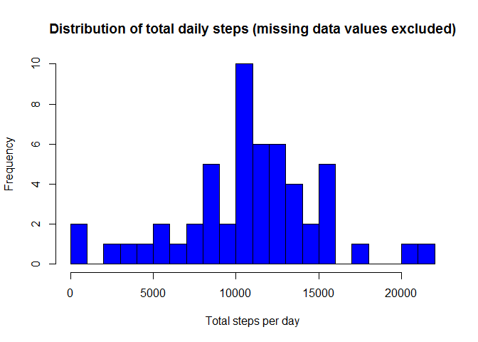

```r
echo = TRUE #Display all code
```

## Synopsis

It is now possible to collect a large amount of data about personal movement using activity monitoring devices such as a Fitbit, Nike Fuelband, or Jawbone Up. These type of devices are part of the “quantified self” movement – a group of enthusiasts who take measurements about themselves regularly to improve their health, to find patterns in their behavior, or because they are tech geeks. But these data remain under-utilized both because the raw data are hard to obtain and there is a lack of statistical methods and software for processing and interpreting the data.

This assignment makes use of data from a personal activity monitoring device. This device collects data at 5 minute intervals through out the day. The data consists of two months of data from an anonymous individual collected during the months of October and November, 2012 and include the number of steps taken in 5 minute intervals each day.

The purpose of the assessment was to display skills in:

* loading and preprocessing data
* imputing missing values
* interpreting data to answer research questions

## Data

The data for this assignment was downloaded from the course web
site at [this url](https://d396qusza40orc.cloudfront.net/repdata%2Fdata%2Factivity.zip) as a zip file, and then extracted into the working directory.

The variables included in this dataset are:

* **steps**: Number of steps taking in a 5-minute interval (missing
    values are coded as `NA`)

* **date**: The date on which the measurement was taken in YYYY-MM-DD
    format

* **interval**: Identifier for the 5-minute interval in which
    measurement was taken

The dataset is stored in a comma-separated-value (CSV) file and there are a total of 17,568 observations in this dataset.

## Turning warnings off globally


```r
knitr::opts_chunk$set(warning=FALSE)
```

## 1. Loading and preprocessing the data

First, load the data

```r
colclass = c("integer", "character", "integer")
df <- read.csv("activity.csv", head=TRUE, colClasses=colclass, na.strings="NA")
head(df)
```

```
##   steps       date interval
## 1    NA 2012-10-01        0
## 2    NA 2012-10-01        5
## 3    NA 2012-10-01       10
## 4    NA 2012-10-01       15
## 5    NA 2012-10-01       20
## 6    NA 2012-10-01       25
```
Next, process the data for analysis. Date columns need to be set to the correct format, and missing values need to be removed. The cleaned data is then saved to a new data frame, retaining the original dataset intact.


```r
df$date <- as.Date(df$date)
df_sub <- subset(df, !is.na(df$steps))
```

## 2. What is mean total number of steps taken per day?

To answer this question, we plot a histogram showing the daily total number of steps.


```r
dailysteps <- tapply(df_sub$steps, df_sub$date, sum, na.rm=TRUE, simplify=T)
dailysteps <- dailysteps[!is.na(dailysteps)]

hist(x=dailysteps,
     col="blue",
     breaks=20,
     xlab="Total steps per day",
     ylab="Frequency",
     main="Distribution of total daily steps (missing data values excluded)")
```

<!-- -->

Finally, we need to calculate the mean total number of steps per day.


```r
mean(dailysteps)
```

```
## [1] 10766.19
```
We should also calculate the median to account for any skewness of the data.


```r
median(dailysteps)
```

```
## [1] 10765
```

## 3. What is the average daily activity pattern?

Average daily activity pattern is best visualised using a time series plot. Activity is measured in 5-minute intervals

## Imputing missing values


## Are there differences in activity patterns between weekdays and weekends?
